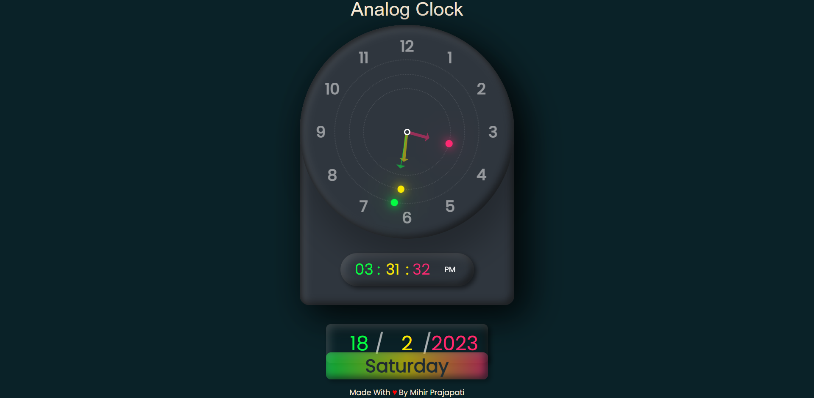

# Analog Clock

* ## some basic math about degree

1. ### For h Hour

    $$
        12hr \rarr360 \degree\\ 
        \therefore 1hr \rarr 30 \degree\\
        \therefore for \space h \space hour = (30h + \frac{m}{2})
    $$

2. ### For m Minute

    $$
        60min \rarr 360\degree\\ 
        \therefore 1min \rarr 6 \degree\\
        \therefore for \space m \space minute = (6m\degree)
    $$

3. ### For s Second

    $$
        60sec \rarr 360\degree\\ 
        \therefore 1sec \rarr 6 \degree\\
        \therefore for \space s \space second = (6s\degree)
    $$

* ## Here Is The ScreenShot Of Analog Clock
 
     

* ## Font Used In CSS Is 

  ```css
    @import url('https://fonts.googleapis.com/css2?family=Poppins:wght@200;300;400&display=swap');

    font-family: 'Poppins', sans-serif;

* ## Here are files
    1. [index.html](index.html)
    2. [script.js](script.js)
    3. [style.css](style.css)